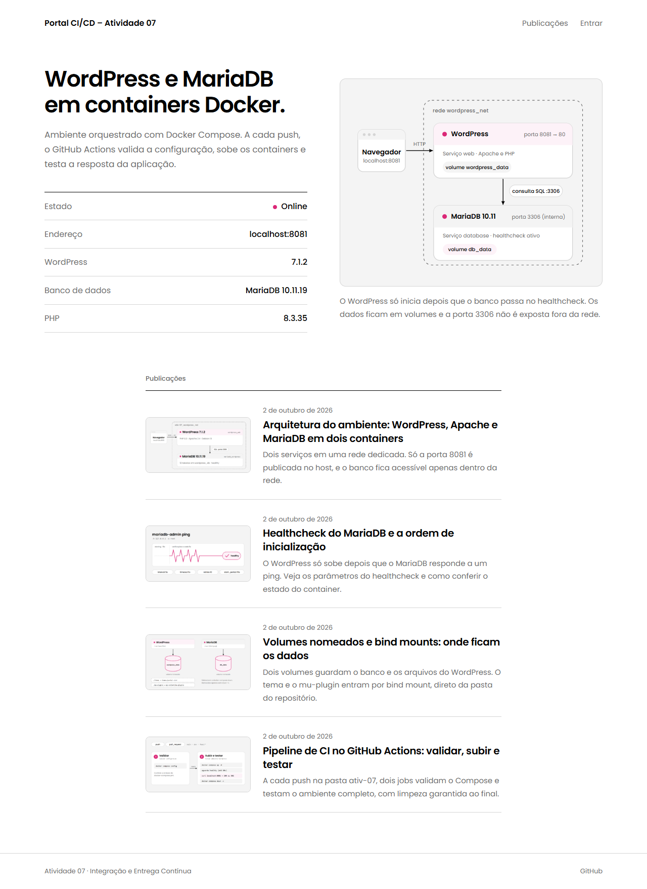
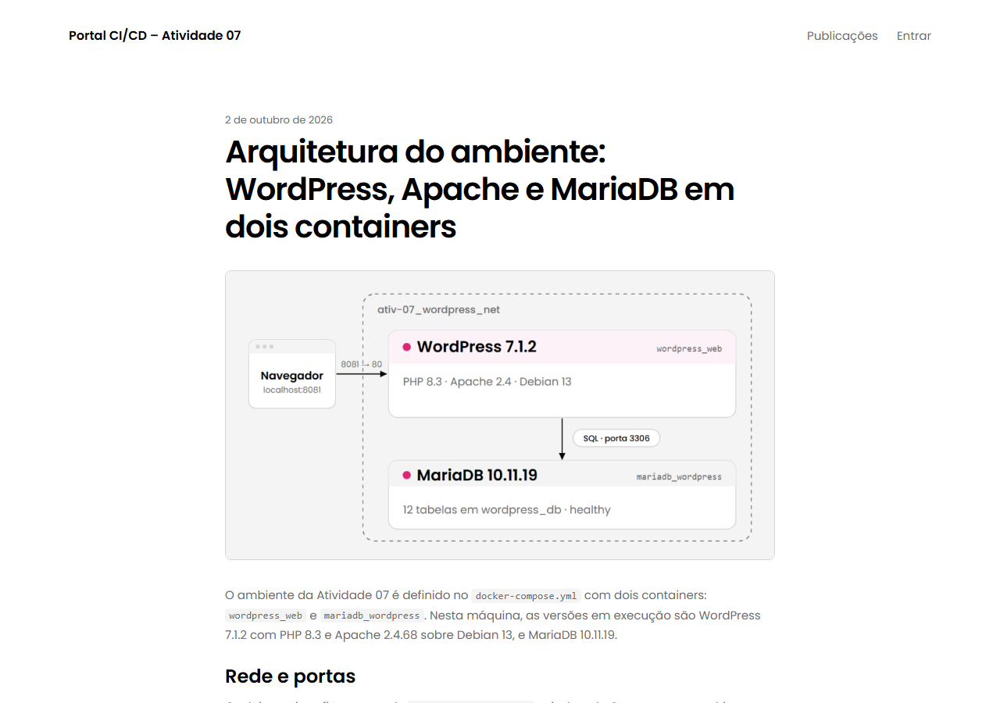
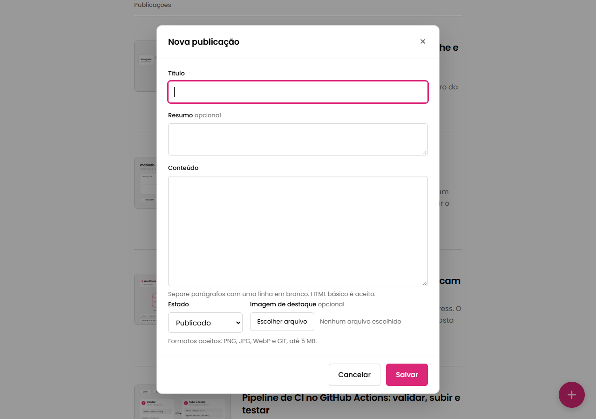

# 🔁 Integração e Entrega Contínua (CI/CD)

Estudos, atividades práticas e pipelines de automação da disciplina de **Integração e Entrega Contínua**, do curso de **Desenvolvimento de Software Multiplataforma** da **Fatec Diadema Luigi Papaiz**.

<p>
  
  
  
  
  
  
  
</p>

---

## 📂 Estrutura

```text
integracao-e-entrega-continua/
├── .github/workflows/        # Uma pipeline por atividade, mais os estudos e o SonarCloud
├── ativ-01/                  # Git, GitHub e primeira pipeline (Python)
├── ativ-02/                  # Calculadora em Node.js com Jest
├── ativ-04/                  # Qualidade e segurança (ESLint, cobertura, secret scan)
├── ativ-05/                  # Estratégia de Matrix (Python)
├── ativ-06/                  # Dockerfile, Docker Hub e deploy no Render
├── ativ-07/                  # WordPress + MariaDB com Docker Compose
├── estudos/                  # Guia de conceitos e resumo para a prova
├── requirements.txt          # Dependências Python dos estudos
├── sonar-project.properties  # Configuração do SonarCloud
└── vercel.json               # Rewrite para publicar a ativ-06
```

> [!NOTE]
> A Atividade 03 não tem pasta própria. Ela é só o workflow [`ativ-03-pipeline-linguagem-favorita-js.yml`](.github/workflows/ativ-03-pipeline-linguagem-favorita-js.yml).

---

## 🗓️ Atividades

| # | Data | Tema | Pasta | Workflow | Conceitos |
|---|------|------|-------|----------|-----------|
| 01 | 19/08 | Primeira pipeline | [`ativ-01`](ativ-01/) | [`ativ-01`](.github/workflows/ativ-01-primeira-pipeline-py.yml) | Git, branches, Pull Request, `pytest`, job condicional de deploy |
| 02 | 19/08 | Calculadora em JavaScript | [`ativ-02`](ativ-02/) | [`ativ-02`](.github/workflows/ativ-02-pipeline-calculadora-js.yml) | Jest, 4 jobs paralelos, `needs` |
| 03 | 26/08 | Linguagem favorita | n/a | [`ativ-03`](.github/workflows/ativ-03-pipeline-linguagem-favorita-js.yml) | `npm install`, `npm test`, bloco `run: \|` |
| 04 | 26/08 | Qualidade e segurança | [`ativ-04`](ativ-04/) | [`ativ-04`](.github/workflows/ativ-04-pipeline-qualidade-seguranca-js.yml) | ESLint, cobertura mínima de 80%, varredura de segredos |
| 05 | 02/09 | Matrix Strategy | [`ativ-05`](ativ-05/) | [`ativ-05`](.github/workflows/ativ-05-pipeline-matrix-py.yml) | 3 Ubuntu × 2 Python = 6 execuções em paralelo |
| 06 | 30/09 | Pudim com Dockerfile | [`ativ-06`](ativ-06/) | [`ativ-06`](.github/workflows/ativ-06-pipeline-docker-pudim.yml) | Dockerfile, NGINX Alpine, Docker Hub, Compose, Render |
| 07 | 02/10 | WordPress + MariaDB | [`ativ-07`](ativ-07/) | [`ativ-07`](.github/workflows/ativ-07-pipeline-docker-wordpress.yml) | Compose multi-container, healthcheck, volumes, instalação automática com WP-CLI, teste HTTP |

<details>
<summary><b>Detalhes de cada atividade</b></summary>

- **01:** [`Guia-de-Versionamento-e-Colaboracao.md`](ativ-01/Guia-de-Versionamento-e-Colaboracao.md) com o fluxo `main` ← `dev` ← `feat/*`, Pull Requests, code review e resolução de conflitos, ilustrado com 8 capturas em [`images/`](ativ-01/images/). Teste em [`test_exemplo.py`](ativ-01/test_exemplo.py).
- **02:** aplicação interativa em Node.js (`index.js` e `calculator.js`) com um arquivo de teste por operação em [`tests/`](ativ-02/tests/). Os jobs `teste-soma`, `teste-subtracao`, `teste-multiplicacao` e `teste-divisao` rodam em paralelo e liberam o `deploy`.
- **03:** estrutura padrão em JavaScript, com comentários explicando cada comando e o operador multilinha `|`.
- **04:** [`README`](ativ-04/README.md) próprio com a simulação dos 4 cenários de falha (lint, testes, cobertura e segredos). O script [`check-secrets.js`](ativ-04/scripts/check-secrets.js) varre o código atrás de credenciais expostas. A esteira tem os jobs `analise-linter`, `testes-unitarios`, `cobertura-codigo` e `analise-seguranca`, todos antes do `deploy`. Há também um [`Dockerfile`](ativ-04/Dockerfile) em estágios.
- **05:** [`test_matrix.py`](ativ-05/test_matrix.py) executado em `ubuntu-latest`, `ubuntu-24.04` e `ubuntu-22.04`, cada um com Python 3.11 e 3.12.
- **06:** clone do pudim.com.br servido por NGINX Alpine. A pipeline valida os arquivos, faz build e push da imagem `emillybudri/pudim-dockerfile:v1` e testa com `docker pull` e `docker compose up`. Em produção: [pudim-dockerfile-v1.onrender.com](https://pudim-dockerfile-v1.onrender.com/).
- **07:** ambiente WordPress com tema próprio, banco MariaDB, healthcheck e CRUD de publicações pelo próprio site. Veja a seção abaixo.

</details>

---

## 🌐 Destaque: Atividade 07

Ambiente **WordPress + MariaDB 10.11** orquestrado com Docker Compose, com um tema desenvolvido do zero, ilustração da arquitetura e gerenciamento de publicações direto na página.

<table align="center">
  <tr>
    <th align="center" width="50%">Página inicial<br /><sub>Ambiente, diagrama e publicações</sub></th>
    <th align="center" width="50%">Publicação<br /><sub>Imagem de destaque e conteúdo</sub></th>
  </tr>
  <tr>
    <td align="center" width="50%"></td>
    <td align="center" width="50%"></td>
  </tr>
</table>

- **Dados reais:** a página inicial mostra as versões de WordPress, PHP e MariaDB lidas do servidor em execução.
- **CRUD pelo site:** logado, o botão **+** cria publicações e cada item ganha *Editar* e *Excluir*. As ações usam a REST API do WordPress, que valida permissão e nonce. Excluir envia para a lixeira.
- **Sobe já instalado:** uma imagem própria instala o WordPress sozinha no primeiro boot (WP-CLI), com idioma, tema, usuário e publicações iniciais. Sem assistente de instalação.
- **Dados no banco:** as publicações vivem no MariaDB. O repositório guarda o tema, o conteúdo inicial e os scripts de instalação.
- **Infra:** rede `bridge` dedicada, volumes `db_data` e `wordpress_data`, tema e `mu-plugins` montados por bind mount, e `depends_on` com `service_healthy`.

<details>
<summary><b>Ver o formulário de nova publicação</b></summary>

<br />


</details>

```text
ativ-07/
├── Dockerfile                # WordPress + WP-CLI + tema + conteúdo inicial
├── docker-compose.yml        # WordPress + MariaDB, rede, volumes e healthcheck
├── .env.example              # Variáveis opcionais (porta, usuário, senha)
├── docker/                   # Instalação automática no primeiro boot
├── seed/                     # Publicações iniciais e ilustrações
├── mu-plugins/               # Ativa o tema, ajusta a URL e a tela de login
├── theme/                    # Tema "Portal CI/CD" (PHP, CSS e JS)
│   ├── parts/arquitetura.php # Ilustração SVG da arquitetura
│   └── app.js                # CRUD via REST API
└── screenshots/              # Imagens usadas neste README
```

> [!TIP]
> **Acesso em 3 passos:** `docker compose up -d --build` na pasta `ativ-07/`, abra `http://localhost:8081` e clique em **Entrar**. A tela de login mostra o usuário e a senha (`admin` / `admin123`). Detalhes e deploy no Render em [`ativ-07/README.md`](ativ-07/README.md).

---

## 🧪 Pipelines

| Workflow | Jobs | Gatilho |
|----------|------|---------|
| [`01-estrutura-padrao`](.github/workflows/01-estrutura-padrao.yml) | Estudo da sintaxe básica do YAML | `push` |
| [`02-estudo-conceitos-avancados`](.github/workflows/02-estudo-conceitos-avancados.yml) | `analise-seguranca`, `analise-linter`, `testes-unitarios-matrix`, `testes-e2e` | `push` e `pull_request` |
| [`ativ-01`](.github/workflows/ativ-01-primeira-pipeline-py.yml) | `teste` → `deploy` | `push` e `pull_request` |
| [`ativ-02`](.github/workflows/ativ-02-pipeline-calculadora-js.yml) | 4 testes em paralelo → `deploy` | `push` e `pull_request` |
| [`ativ-03`](.github/workflows/ativ-03-pipeline-linguagem-favorita-js.yml) | `teste` | `push` |
| [`ativ-04`](.github/workflows/ativ-04-pipeline-qualidade-seguranca-js.yml) | lint, testes, cobertura e segurança → `deploy` | `push` e `pull_request` |
| [`ativ-05`](.github/workflows/ativ-05-pipeline-matrix-py.yml) | `qualidade` (matriz de 6 execuções) | `push` e `pull_request` |
| [`ativ-06`](.github/workflows/ativ-06-pipeline-docker-pudim.yml) | `validacao-arquivos` → `build` → `teste-pull-e-execucao` → `deploy` | `push` e `pull_request` |
| [`ativ-07`](.github/workflows/ativ-07-pipeline-docker-wordpress.yml) | `validar-configuracao` → `testar-ambiente-wordpress` | `push` e `pull_request` em `ativ-07/**` |
| [`sonarcloud`](.github/workflows/sonarcloud.yml) | `sonarcloud` (análise de qualidade) | `push` e `pull_request` |

---

## ▶️ Como executar

Cada atividade roda de forma independente. Os comandos partem da raiz do repositório.

**Python** (atividades 01 e 05)

```bash
pip install -r ativ-05/requirements.txt
pytest ativ-05/
```

**Node.js** (atividades 02 e 04)

```bash
cd ativ-04
npm install
npm run lint && npm test && npm run test:coverage && npm run check-secrets
```

**Docker** (atividades 06 e 07)

```bash
# Atividade 06: http://localhost:8080
cd ativ-06 && docker compose up -d

# Atividade 07: http://localhost:8081
cd ativ-07 && docker compose up -d --build   # usuário admin, senha admin123
docker compose ps          # estado dos containers
docker compose down -v     # para tudo e apaga os volumes
```

> [!NOTE]
> `docker compose down -v` apaga o banco da Atividade 07, incluindo as publicações criadas pelo site.

---

## 📚 Material de estudo

O [**Guia de Conceitos de CI/CD**](estudos/Guia-Conceitos-CI-CD-Resumo-Prova.md) reúne o conteúdo das Aulas 01 a 05, com links para os workflows de exemplo:

| Tema | O que cobre |
|------|-------------|
| Cultura DevOps | Cascata × Ágil × DevOps, CI, Continuous Delivery e Continuous Deployment |
| Git avançado | `git reset` (`--soft`, `--mixed`, `--hard`), `git revert`, branches e Pull Requests |
| GitHub Actions | `uses`, `with`, `run`, runners isolados e dependência entre jobs com `needs` |
| Testes e qualidade | Pirâmide de testes, padrão AAA, cobertura e *Quality Gates* |
| Matrix e cache | Multiplicação de ambientes e `cache: 'pip'` |
| Segurança | Dependabot, CodeQL, Secret Scanning, Push Protection e `SECURITY.md` |
| Secrets e Environments | `${{ secrets.* }}`, `${{ vars.* }}` e regras de proteção de deploy |
| SonarCloud | Integração com `sonar-project.properties` e workflow dedicado |

O exemplo mais enxuto da sintaxe está em [`01-estrutura-padrao.yml`](.github/workflows/01-estrutura-padrao.yml), com o teste [`estudos/test_soma.py`](estudos/test_soma.py).

---

## 🔄 Fluxo de Git

```text
main  (estável)
  ↑
 dev  (integração)
  ↑
feat/*  (desenvolvimento)
```

1. As branches `feat/*` nascem da `dev`.
2. Pull Requests para `dev` ou `main` disparam as pipelines.
3. O merge acontece depois da aprovação e do sucesso de todos os jobs.

---

## 🛠️ Ferramentas

- **Automação:** [GitHub Actions](https://github.com/features/actions) e [SonarCloud](https://sonarcloud.io/)
- **Containers:** [Docker](https://www.docker.com/), Docker Compose e [Docker Hub](https://hub.docker.com/)
- **Linguagens:** Python 3.12 (`pytest`) e Node.js 22 (`Jest`, `ESLint`)
- **Aplicações:** NGINX Alpine, WordPress e MariaDB
- **Deploy:** [Render](https://render.com/) e [Vercel](https://vercel.com/)

---

## 👤 Autoria

**Emilly Budri Bognar** · RA 2171392511009
Desenvolvimento de Software Multiplataforma · Fatec Diadema Luigi Papaiz

Projeto acadêmico da disciplina de Integração e Entrega Contínua.
