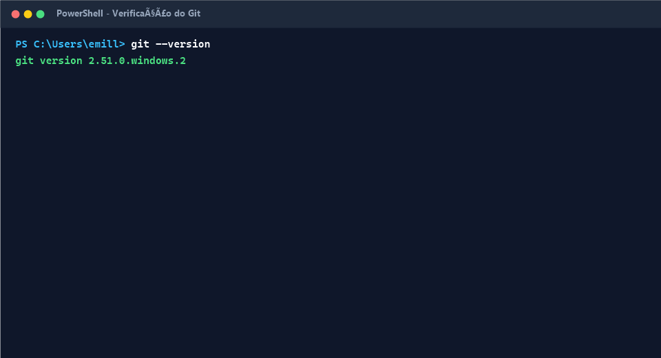
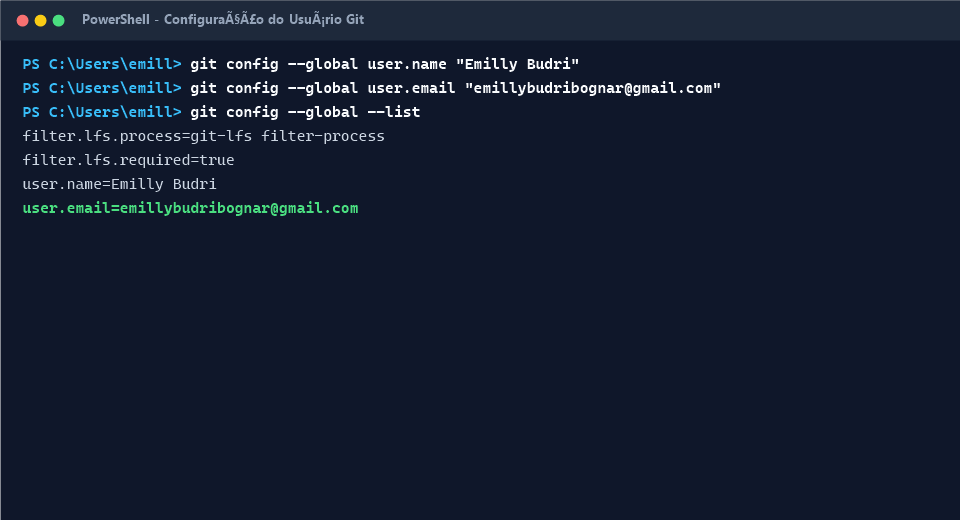
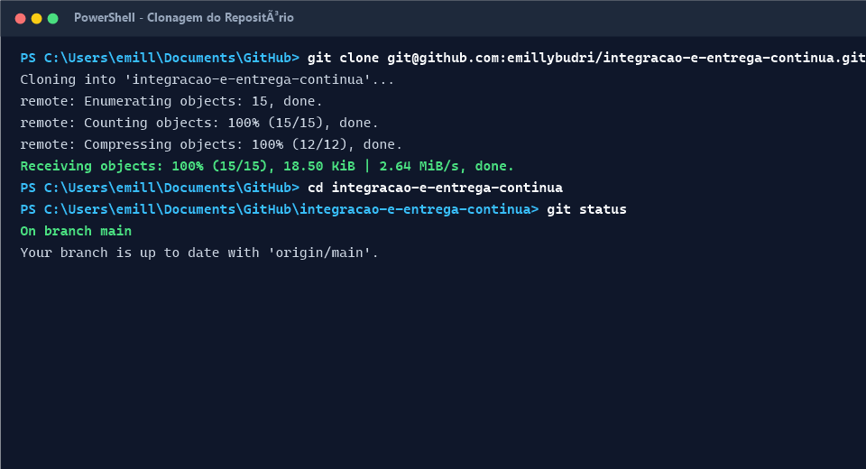
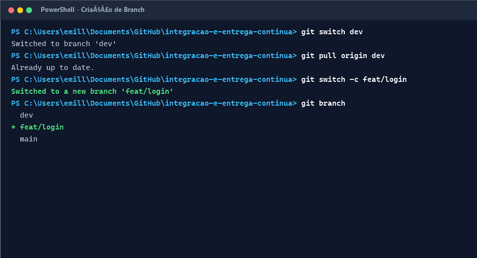
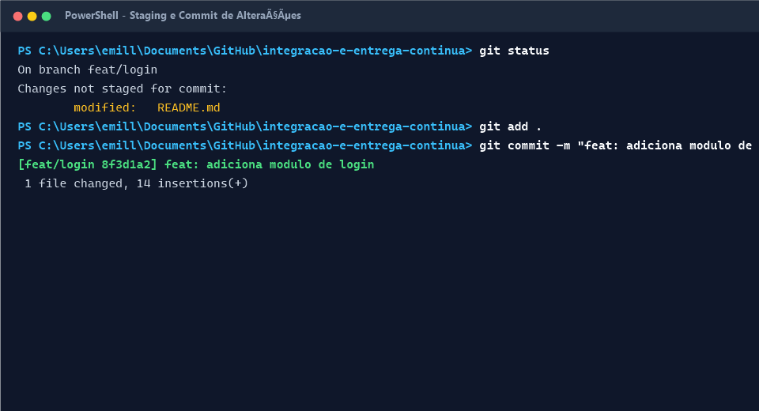
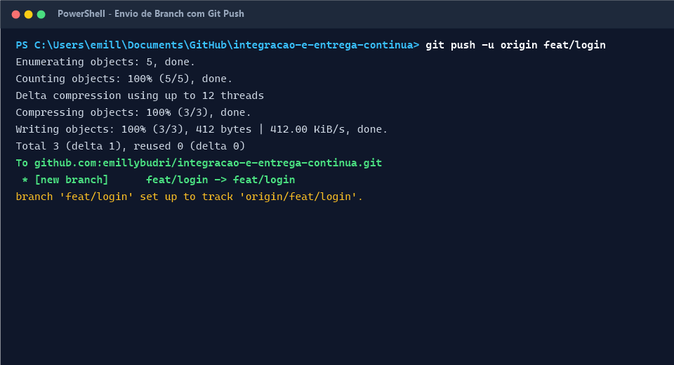
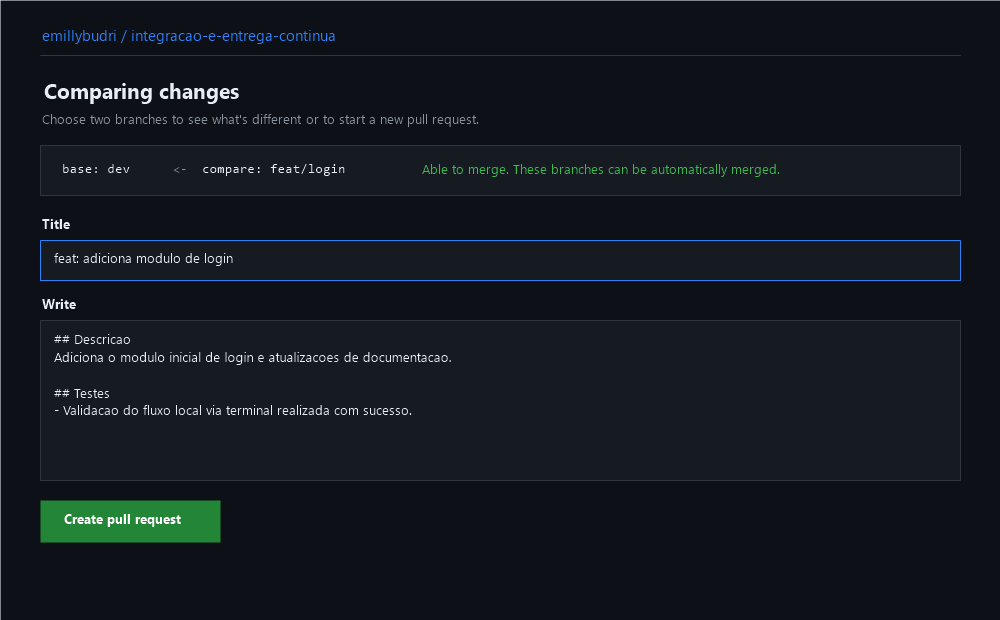
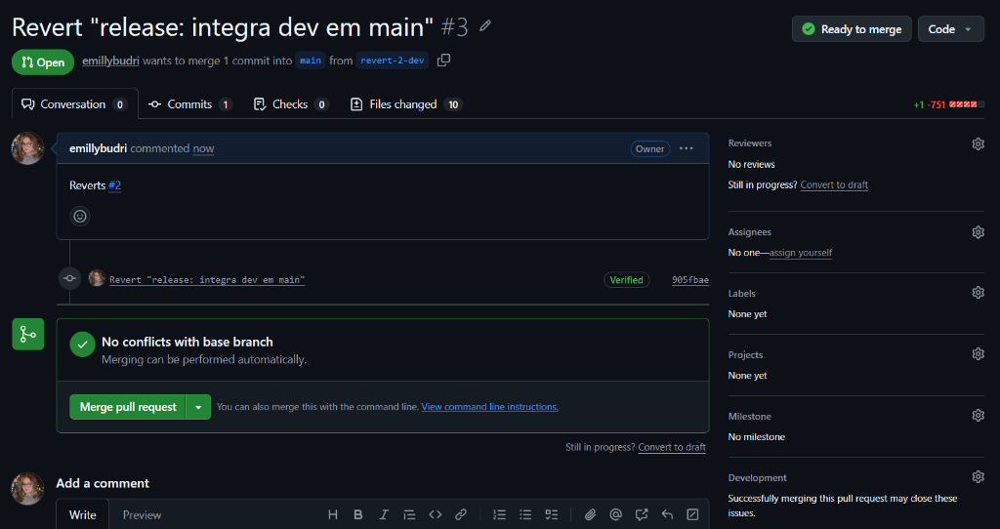

/*A empresa XPTO utiliza Git e GitHub para gerenciamento de configuração, controle de versão e desenvolvimento colaborativo. Um novo desenvolvedor acaba de entrar na empresa e precisa começar a trabalhar no projeto principal (`emillybudri/integracao-e-entrega-continua`).
Crie um Guia de Versionamento e Colaboração da XPTO, explicando o fluxo utilizado pela empresa desde a obtenção do projeto até a integração de uma alteração ao código principal.*/

# Guia de Versionamento e Colaboração

## Git e GitHub para iniciantes

Utilizamos **Git e GitHub** no repositório [`emillybudri/integracao-e-entrega-continua`](https://github.com/emillybudri/integracao-e-entrega-continua) para controlar versões do código e permitir que toda a equipe trabalhe de forma colaborativa e segura.

O fluxo principal de branches é:

```text
main
  ↑
 dev
  ↑
feat/minha-feature
```

O fluxo padrão consiste em trabalhar em uma branch `feat/*`, abrir um Pull Request para `dev` e, após validação, integrar as alterações à `main`.

---

# Conceitos de CI/CD e Pipeline

### O que é CI (Integração Contínua)?
**Continuous Integration (CI)** é a prática de integrar alterações de código ao repositório compartilhado com frequência. A cada envio de código (Push ou Pull Request), o sistema executa verificações automáticas para garantir que a nova alteração não quebre o projeto.

### O que é CD (Entrega e Implantação Contínua)?
**Continuous Delivery / Deployment (CD)** é a automação da fase de publicação do software. Assim que o código é aprovado e integrado, o CD se encarrega de preparar e realizar o deploy (implantação) da aplicação nos ambientes de teste ou produção de forma automática.

### O que é uma Pipeline?
A **Pipeline** (ou esteira de automação) é a sequência de etapas automatizadas pelas quais o código passa desde o envio até a publicação final. Uma pipeline típica inclui etapas como:

```text
Commit / Push → Build (Compilação) → Linters (Análise estática) → Testes Automatizados → Deploy
```

---

# Instalando o Git

Acesse:

https://git-scm.com/

Baixe e instale o Git para o seu sistema operacional.

Depois, abra o terminal e verifique se a instalação foi bem-sucedida:

```bash
git --version
```

Se aparecer a versão instalada, o Git está pronto para uso.

### Print



---

# Configurando o Git

Informe seu nome:

```bash
git config --global user.name "Emilly Budri"
```

Informe seu e-mail (deve ser o mesmo associado à sua conta do GitHub):

```bash
git config --global user.email "emilly.budri@email.com"
```

Confira a configuração:

```bash
git config --global --list
```

### Print



---

# Clonando o projeto

No GitHub, navegue até o repositório [`emillybudri/integracao-e-entrega-continua`](https://github.com/emillybudri/integracao-e-entrega-continua), clique em **Code → SSH** (ou HTTPS) e copie a URL.

No terminal:

```bash
git clone git@github.com:emillybudri/integracao-e-entrega-continua.git
```

Ou via HTTPS:

```bash
git clone https://github.com/emillybudri/integracao-e-entrega-continua.git
```

Acesse o diretório do projeto:

```bash
cd integracao-e-entrega-continua
```

Verifique o status inicial:

```bash
git status
```

O comando `clone` baixa todo o histórico e a estrutura do repositório para a sua máquina local.

### Print



---

# Entendendo o Git

O Git trabalha com as seguintes etapas:

```text
Working Directory
       ↓ git add
Staging Area
       ↓ git commit
Repositório Local
       ↓ git push
GitHub
```

### Working Directory

É o diretório de trabalho onde estamos alterando e criando arquivos.

### Staging Area

É a área de preparação onde colocamos as alterações que farão parte do próximo commit.

```bash
git add README.md
```

ou para adicionar todas as alterações:

```bash
git add .
```

### Commit

Registra um snapshot das alterações na Staging Area no histórico local:

```bash
git commit -m "feat: adiciona modulo de login"
```

---

# Branches

Branches permitem desenvolver funcionalidades isoladamente sem impactar a linha principal do código.

A estrutura utilizada é:

```text
main
 │
 └── dev
      │
      ├── feat/login
      ├── feat/cadastro
      └── fix/payment
```

### `main`

Código principal e em produção (estável).

### `dev`

Branch principal de desenvolvimento e integração contínua.

### `feat/*`

Branch criada para o desenvolvimento de uma funcionalidade específica.

---

# Criando uma branch

Antes de iniciar uma tarefa, sempre garanta que sua branch `dev` local está atualizada com o servidor:

```bash
git switch dev
git pull origin dev
```

Em seguida, crie sua nova branch de funcionalidade:

```bash
git switch -c feat/login
```

Verifique em qual branch você se encontra:

```bash
git branch
```

A branch ativa aparecerá marcada com um asterisco (`*`).

### Print



---

# Boas práticas de nomenclatura

Use nomes curtos, claros e em minúsculo.

### Funcionalidades

```text
feat/login
feat/user-registration
feat/payment
```

### Correções

```text
fix/login-validation
fix/payment-error
```

### Refatoração

```text
refactor/auth-service
```

### Documentação

```text
docs/update-readme
```

Evite:

```text
teste
minha-branch
alteracoes
coisas
```

---

# Fazendo uma alteração

Após implementar suas alterações no projeto:

```bash
git status
```

O comando mostra os arquivos modificados, criados ou excluídos.

Para visualizar as diferenças em detalhes:

```bash
git diff
```

---

# Staging e Commit

Adicione as alterações para a **Staging Area**:

```bash
git add .
```

Confira o que está pronto para ser commitado:

```bash
git diff --staged
```

Em seguida, faça o commit com uma mensagem descritiva:

```bash
git commit -m "feat: adiciona modulo de login"
```

### Print



### Exemplos de commits padronizados

```text
feat: adiciona cadastro de usuário
fix: corrige validação de login
docs: atualiza documentação no README
refactor: reorganiza serviço de autenticação
test: adiciona testes de integração
```

---

# Push

Envie sua nova branch e seus commits para o GitHub:

```bash
git push -u origin feat/login
```

O argumento `-u` (ou `--set-upstream`) vincula sua branch local à branch remota no GitHub. Nos próximos envios da mesma branch, basta executar:

```bash
git push
```

### Print



---

# Fetch, Pull e Push

### `git fetch`

Busca atualizações do servidor remoto sem alterar os arquivos locais:

```bash
git fetch
```

### `git pull`

Busca as alterações do servidor e as integra (merge) automaticamente na branch atual:

```bash
git pull
```

### `git push`

Envia os commits locais armazenados para o servidor remoto:

```bash
git push
```

Resumo:

```text
fetch → buscar informações
pull  → buscar + integrar
push  → enviar
```

---

# Pull Request e Integração Contínua (CI)

Após enviar a branch com `git push`, acesse o repositório no GitHub para abrir um Pull Request (PR):

```text
feat/login → dev
```

O Pull Request solicita a integração do seu código à branch de desenvolvimento `dev`.

### Em qual etapa ocorre a Pipeline de CI?

* **Execução Automatizada:**
  A pipeline de CI é acionada **imediatamente após a abertura do Pull Request** (e a cada novo commit enviado para essa branch).
* **O que acontece nessa etapa:**
  A esteira automatizada compila o código, executa linters e roda a suíte de testes. Se algum teste falhar, o Pull Request fica bloqueado até que a correção seja feita.

### Print



---

# Code Review

Durante a revisão de código, outro desenvolvedor analisará suas alterações.

Ele pode:
* **Aprovar (Approve)** a integração;
* **Fazer comentários** sobre pontos de melhoria;
* **Solicitar alterações (Request Changes)**.

Se forem necessárias correções, basta realizar as edições locais, fazer o commit e dar o push:

```bash
git add .
git commit -m "fix: ajusta validação do login"
git push
```

Ao fazer o push, a pipeline de CI é disparada automaticamente de novo para revalidar o código.

---

# Merge e Entrega Contínua (CD)

O `merge` combina os históricos da branch de funcionalidade e da branch destino.

```text
feat/login
   ↓
  dev
```

A integração é realizada diretamente pela interface web do GitHub através do botão **Merge pull request**.

### Em qual etapa ocorre a Pipeline de CD?

* **Disparo do CD:**
  Assim que o **Merge** para a branch `dev` ou `main` é finalizado no GitHub, a pipeline de CD entra em ação automaticamente.
* **O que acontece nessa etapa:**
  O sistema realiza o deploy automático da versão atualizada para o ambiente de testes/homologação (quando mesclado em `dev`) ou para produção (quando mesclado em `main`).

Caso precise realizar um merge localmente via terminal:

```bash
git switch dev
git merge feat/login
git push origin dev
```

### Print



---

# Rebase

O `rebase` permite reaplicar seus commits locais no topo da versão mais recente da branch base.

```text
dev:        A---B---C
                 \
feature:          D---E
```

Enquanto você trabalhava na `feature`, a branch `dev` recebeu o commit `C`.

Para trazer os commits de `dev` e manter um histórico linear:

```bash
git fetch origin
git rebase origin/dev
```

O histórico ficará assim:

```text
A---B---C---D'---E'
```

### Quando usar?

Para manter sua branch de funcionalidade sempre atualizada em relação à `dev` e evitar commits desnecessários de merge.

Atenção: Nunca faça `rebase` em branches públicas ou compartilhadas com outros desenvolvedores.

---

# Merge x Rebase

### Merge

```bash
git merge dev
```

Integra as branches criando um commit de mesclagem (preserva a história exata das branches).

### Rebase

```bash
git rebase dev
```

Reescreve o histórico colocando seus commits no topo da branch base.

---

# Amend

O `git commit --amend` altera ou complementa o **último commit** realizado.

Caso tenha esquecido de incluir um arquivo no último commit:

```bash
git add arquivo-esquecido.ts
git commit --amend
```

Se desejar alterar apenas a mensagem do último commit:

```bash
git commit --amend -m "feat: adiciona autenticação de usuário"
```

---

# Reset

O `git reset` altera o ponteiro do repositório local para um commit anterior no histórico.

### `--soft`

```bash
git reset --soft HEAD~1
```

Desfaz o último commit, mas mantém as alterações na **Staging Area**.

---

### `--mixed` (Padrão)

```bash
git reset HEAD~1
```

Desfaz o commit e remove as alterações da Staging Area, mas preserva as modificações no **Working Directory**.

---

### `--hard`

```bash
git reset --hard HEAD~1
```

Desfaz o commit e **descarta permanentemente** todas as alterações.

---

# Restore

O `git restore` é utilizado para descartar modificações locais ou remover arquivos da Staging Area.

Descartar alterações locais em um arquivo não commitado:

```bash
git restore README.md
```

Remover um arquivo da Staging Area (desfazer `git add`):

```bash
git restore --staged README.md
```

---

# Revert

O `git revert` desfaz um commit específico **criando um novo commit de reversão**.

```bash
git revert abc1234
```

É o método mais seguro para desfazer alterações já enviadas ao servidor remoto, pois preserva o histórico.

---

# Reset x Revert

| Comando | Escopo Recomendado | Comportamento |
| :--- | :--- | :--- |
| `reset` | Local (não enviado) | Move o ponteiro do histórico para trás |
| `revert` | Remoto / Compartilhado | Cria um novo commit desfazendo o anterior |

---

# Stash

O `stash` armazena temporariamente suas modificações não commitadas, limpando o Working Directory.

Guardar alterações:

```bash
git stash
```

Recuperar alterações:

```bash
git stash pop
```

---

# Cherry-pick

O `cherry-pick` permite copiar **um commit específico** de outra branch e aplicá-lo na branch atual.

```bash
git cherry-pick abc1234
```

---

# Resolvendo Conflitos

Um conflito ocorre quando alterações incompatíveis afetam as mesmas linhas de um arquivo.

O Git indicará os marcadores:

```text
<<<<<<< HEAD
código atual da sua branch
=======
código vindo da branch dev
>>>>>>> feat/login
```

Passos para resolver:
1. Abra o arquivo e selecione o código correto.
2. Remova os marcadores (`<<<<<<<`, `=======`, `>>>>>>>`).
3. Adicione o arquivo resolvido e conclua a operação:

```bash
git add .
git commit -m "fix: resolve conflito de integracao"
```

Para cancelar uma operação com conflito:

```bash
git merge --abort
# ou
git rebase --abort
```

---

# Fluxo Completo de Desenvolvimento e CI/CD

```text
1. Instalar & Configurar Git
       ↓
2. Clonar `emillybudri/integracao-e-entrega-continua`
       ↓
3. git switch dev && git pull origin dev
       ↓
4. git switch -c feat/minha-feature
       ↓
5. Desenvolver e testar localmente
       ↓
6. git add . && git commit -m "feat: minha alteracao"
       ↓
7. git push -u origin feat/minha-feature
       ↓
8. Abrir Pull Request no GitHub (`feat/*` → `dev`)
       ↓
9. PIPELINE DE CI EXECUTADA AUTOMATICAMENTE (Testes, Linters & Build)
       ↓
10. Passar pelo Code Review (Revisão por membros da equipe)
       ↓
11. Merge do Pull Request para `dev` no GitHub
       ↓
12. PIPELINE DE CD EXECUTADA AUTOMATICAMENTE (Deploy em Staging)
       ↓
13. Merge final de `dev` para `main` (Deploy em Produção via CD)
```

---

# Guia Rápido e Comandos Utilitários

Abaixo está o resumo consolidado de todos os comandos essenciais para o trabalho no dia a dia:

```bash
# Configuração inicial
git config --global user.name "Seu Nome"
git config --global user.email "seu@email.com"
git config --global --list

# Obter projeto e verificar estado
git clone git@github.com:emillybudri/integracao-e-entrega-continua.git
cd integracao-e-entrega-continua
git status
git remote -v

# Trabalho com branches
git switch dev                         # Alterna para a branch dev
git pull origin dev                    # Atualiza branch dev local
git switch -c feat/minha-feature       # Cria e alterna para nova branch
git branch                             # Lista branches locais (* indica a atual)
git branch -r                          # Lista branches remotas

# Desenvolvimento e registros (Commits)
git diff                               # Mostra alterações locais não salvas
git add .                              # Move alterações para Staging Area
git diff --staged                      # Mostra alterações na Staging Area
git commit -m "feat: descrição clara"   # Cria o commit local
git commit --amend                     # Altera ou adiciona ao último commit

# Envio e atualização (Push & Pull)
git push -u origin feat/minha-feature  # Primeiro envio da branch ao remoto
git push                               # Envios posteriores
git fetch                              # Busca atualizações do remoto sem mesclar
git fetch --prune                      # Remove referências de branches remotas apagadas

# Histórico e inspeção
git log --oneline                      # Histórico resumido de commits
git log --oneline --graph --all        # Árvore visual de commits e branches

# Desfazer e guardar alterações
git restore arquivo.ts                 # Descarta alterações locais de um arquivo
git restore --staged arquivo.ts        # Remove arquivo da Staging Area (unstage)
git reset --soft HEAD~1                # Desfaz o último commit (mantém staging)
git reset HEAD~1                       # Desfaz o último commit (mantém alterações)
git reset --hard HEAD~1                # Desfaz o último commit e descarta alterações
git revert HASH                        # Cria um novo commit desfazendo outro
git stash                              # Salva alterações temporariamente na pilha
git stash pop                          # Restaura alterações salvas no stash
git cherry-pick HASH                   # Copia um commit específico de outra branch
```

---

Seguindo o fluxo **`switch dev` → `feat/*` → `commit` → `push` → `Pull Request (CI)` → `Code Review` → `Merge (CD)`**, mantemos um histórico limpo, rastreável e integrado com testes automatizados de entrega contínua.
